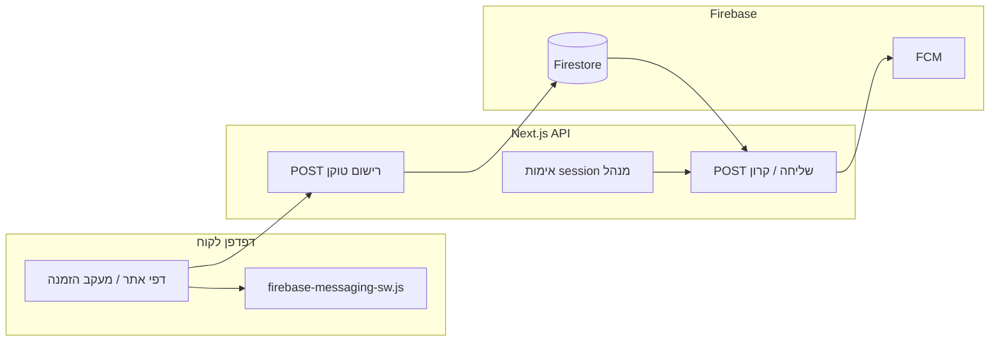

# תכנית: הודעות PUSH (קבוצתיות ואישיות)

## מצב נוכחי בקוד

- פעולות הזמנה (אישור, מוכן, ביטול וכו׳) מתבצעות **מהלקוח** דרך Firestore ב-[`lib/firebase/write-remote.ts`](lib/firebase/write-remote.ts) — אין היום שרת שרץ אחרי כל שינוי.
- יש כבר [`lib/server/firebase-admin-db.ts`](lib/server/firebase-admin-db.ts) (מפתח שירות) ודפוס קרון מאובטח עם `CRON_SECRET` ב-[`app/api/cron/weekly-purge-orders/route.ts`](app/api/cron/weekly-purge-orders/route.ts).
- מסלולי לקוח/ניהול: `APPROVE_ORDER` (מ־`pendingApproval` ל־`work`), `MARK_ORDER_READY` (ל־`ready`), `ADMIN_CANCEL_ORDER` (מחיקת הזמנה מכל עמודה — לפי הבהרתך), תזכורת וואטסאפ לעמודת «מוכן» ב-[`app/admin/page.tsx`](app/admin/page.tsx) (`readyColumnWaRecipients`), והודעה ללקוח ב-[`ADMIN_SET_ORDER_BUSINESS_MESSAGE_TO_CUSTOMER`](lib/store/app-store-actions.ts).
- אין Cloud Functions ב-repo; נשתמש ב-**Next.js API Routes + `firebase-admin/messaging`** כדי לא לסטות מהארכיטקטורה הקיימת.

## ארכיטקטורה (תמצית)

## 1. תשתית FCM Web (לקוח)

- הוספת `firebase/messaging` (מודולרי) בקומפוננטות **client** בלבד.
- קובץ Service Worker ב-[`public/firebase-messaging-sw.js`](public/firebase-messaging-sw.js) שמייבא את `firebase` compat או מגדיר `onBackgroundMessage` לפי התיעוד ב-`node_modules/firebase` / מסמכי הגרסה שלכם.
- משתני סביבה: `NEXT_PUBLIC_FIREBASE_VAPID_KEY` (ממסך Cloud Messaging בקונסולת Firebase).
- UI להפעלת הרשאת התראות (כבר יש בסיס ב-[`components/pwa/use-pwa-install.ts`](components/pwa/use-pwa-install.ts)) — לחבר לרישום טוקן אחרי `Notification.permission === "granted"`.

## 2. מודל נתונים ב-Firestore

לדוגמה (שמות ניתנים לכיווץ):

- **`pushTokens`**: מסמך לכל מכשיר — `fcmToken`, `createdAt`, `topics` או שדות בוליאניים: `wantsBroadcast`, רשימת `orderTokens` (מזהי מעקב) שהמכשיר מעוניין לעקוב אחריהם.
- אינדקסים: אם מחפשים לפי `orderTokens` — `array-contains` + כללים מתאימים.

**רישום טוקן**

- `POST /api/push/register` (או דומה): גוף `{ fcmToken, orderToken? }`.
  - אם יש `orderToken`: לוודא מול Firestore שקיימת הזמנה עם אותו `token` (שאילתה בצד השרת) לפני שמירה — מונע רישום לכל הזמנה.
  - `wantsBroadcast`: ברירת מחדל true אם המשתמש הסכים במסך (מתאים ל«כל הלקוחות» = כל מי שנרשם).

**כללי אבטחה Firestore**: לא לאפשר ללקוח לקרוא את כל `pushTokens`; רישום/עדכון רק דרך ה-API (או חוקים מצומצמים מאוד). שליחת הודעות — רק דרך Admin SDK בשרת.

## 3. שכבת שליחה בשרת

- פונקציה משותפת (למשל [`lib/server/fcm-send.ts`](lib/server/fcm-send.ts)): `getMessaging()` מ-`firebase-admin/messaging`, `sendEach` / `sendEachForMulticast` לפי רשימת טוקנים, טיפול בטוקן לא חוקי (מחיקה מ-Firestore).
- אתחול Admin גם ל-Messaging (אותו credential כמו Firestore).

## 4. הודעות אישיות להזמנה (3 המצבים + שני המקרים הנוספים)

ההנחה: **לא** שולחים על כל מעבר עמודה — רק:

| אירוע | טריגר בקוד | הערות |
|--------|------------|--------|
| אישור אחרי אישור ידני | אחרי `APPROVE_ORDER` | לוודא שההזמנה הייתה ב-`pendingApproval` לפני הפעולה (למסור בבקשה ל-API את `previousColumn` או לבדוק בצד שרת לפני שהמסמך השתנה — הכי בטוח: קריאה ל-API **מיד אחרי** הצלחה עם צילום מצב `{ orderId, approvedFromPending: true }` מאומת מול Firestore בזמן הבקשה, או העברת snapshot מהלקוט לפני המוטציה). |
| מוכן לאיסוף | אחרי `MARK_ORDER_READY` | |
| ביטול מנהל | אחרי `ADMIN_CANCEL_ORDER` | לפי הבהרתך — מכל עמודה; לפני המחיקה לשמור `orderToken` + טלפון לשליחה בבקשה ל-API. |
| תזכורת «מחכים לאיסוף» | הזרם הקיים של תזכורת וואטסאפ לעמודת ready ב-[`app/admin/page.tsx`](app/admin/page.tsx) | להוסיף קריאה מקבילה ל-API ששולחת PUSH לכל `readyColumnWaRecipients` (אותה רשימה). |
| הודעה אישית מהעסק | אחרי `ADMIN_SET_ORDER_BUSINESS_MESSAGE_TO_CUSTOMER` | גוף ההודעה = הטקסט שנשמר ב-`businessMessageToCustomer`. |

**אימות**

- רוט מוגן **session מנהל** (עוגיה כמו ב-[`app/api/admin/session/route.ts`](app/api/admin/session/route.ts)) — לייבא/לשתף פונקציית `verifySession` קיימת אם קיימת ב-`lib/server`, או לאמת עוגיה באותו אופן.
- גוף הבקשה: סוג אירוע + מזהים; השרת טוען טוקנים רלוונטיים מ-Firestore ושולח.

**דגש לביטול**: המסמך נמחק — חייבים לשלוח את פרטי ההזמנה (לפחות `orderToken`) **בבקשה** מהלקוח אחרי שהמוטציה הצליחה, או לשמור עותק ב-API לפני מחיקה (עדיף payload מהלקוח עם אימות session).

## 5. שידור קבוצתי — «נפתחו הזמנות» ב-`orderOpenTime` (למשל 14:30)

- לוגיקת זמן: להשתמש ב-[`lib/business-schedule.ts`](lib/business-schedule.ts) (`JERUSALEM_TZ`, `activeScheduleForCalendarIso`, `orderOpenTime`, scopes `eveBefore` / `sameDay`) כדי להחליט **מתי בדיוק** נשלחת התזכורת (הרגע שבו נפתח חלון ההזמנות ליום העסק הבא — כפי שהגדרתם במערכת, לא קשיח 14:30 בקוד).
- קרון חדש: למשל [`app/api/cron/menu-open-broadcast/route.ts`](app/api/cron/menu-open-broadcast/route.ts) עם אותו `CRON_SECRET`.
- תדירות: מומלץ **כל 5–15 דקות** (UTC ב-`vercel.json`) והקוד בודק «האם עכשיו בירושלים זה רגע הפתיחה + יום עסקים רלוונטי»; **מניעת כפילויות** — מסמך ב-Firestore כמו `broadcastLog/{dateKey}` או `settings/lastMenuOpenPushIso`.
- תוכן ההודעה: ניסוח קבוע + שעת פתיחה מההגדרות (`orderOpenTime`) + אולי שם היום; אפשר להוסיף שדה טקסט ב-`AdminSettings` בעתיד.

## 6. שינויים ב-UI

- מסך לקוח (בית / ניוזלטר / הגדרות PWA): הסכמה ל«התראות על תפריט ומבצעים» + רישום broadcast.
- דף מעקב הזמנה [`app/(customer)/order/[token]/page.tsx`](app/(customer)/order/[token]/page.tsx): אחרי טעינה מוצלחת — הצעה להפעיל התראות עבור **ההזמנה הזו** (רישום `orderToken`).
- אדמין: אין חובה לכפתור חדש לתזכורת ready אם משתלבים בזרם הוואטסאפ הקיים; אם תרצו שליטה נפרדת «רק PUSH» — אפשר טוגל בעתיד.

## 7. פריסה וסביבה

- `firebase-admin` כבר קיים; יש לוודא שבפרודקשן מוגדרים מפתח שירות + VAPID.
- עדכון [`vercel.json`](vercel.json) עם cron לנתיב החדש.
- בדיקות ידניות: הרשאות דפדפן, קבלת PUSH ברקע (Chrome), ובדיקת שליחה מ-local עם משתני env.

## סיכונים ומגבלות

- **iOS Safari / PWA**: התנהגות שונה מהדפדפן לשולחן עבודה; כדאי לתעד למשתמשים «מומלץ התקנה למסך הבית».
- **ספאם**: שידור קבוצתי רק למנויים (`wantsBroadcast`); לא לשלוח לכל רשימת הדיוור בטלפון בלי מכשיר רשום.

## קבצים עיקריים לגעת בהם

- חדש: `public/firebase-messaging-sw.js`, `lib/server/fcm-send.ts`, `app/api/push/register/route.ts`, `app/api/admin/push/notify/route.ts` (או מבנה דומה), `app/api/cron/menu-open-broadcast/route.ts`.
- עריכה: [`lib/store/firebase-app-store.tsx`](lib/store/firebase-app-store.tsx) או נקודות ה-`dispatch` אחרי פעולות רלוונטיות, [`app/admin/page.tsx`](app/admin/page.tsx) (תזכורת ready + אולי הודעה אישית), דף מעקב הזמנה, [`firestore.rules`](firestore.rules) אם קיים.
