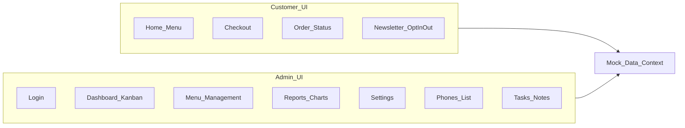

# תוכנית: UI בלבד למערכת "הקוסקוס של מזל"

## הקשר מהאפיון

מערכת דו-צדדית: **אתר לקוח** (תפריט יומי, הזמנה, סטטוס) ו-**ממשק ניהול** (לוח הזמנות לפי שלבים, תפריט, דוחות, הגדרות, רשימת תפוצה). בשלב זה מתעלמים מ: WhatsApp, InforUMobile, Push אמיתי, הדפסות, וכל שמירה בשרת/DB.

הפרויקט ב-`[c:\Users\yarde\OneDrive\Desktop\MAZAL](c:\Users\yarde\OneDrive\Desktop\MAZAL)` כרגע ריק — יש להקים אפליקציה מאפס.

**מבנה ריפו:** אפליקציה **אחת** בקוד משותף — מסלולי לקוח (למשל `app/(customer)/...`) ומסלולי עסק (למשל `app/admin/...`), שני layouts שונים, אותו `components/` ו-`lib/`.

## המלצת טכנולוגיה

| בחירה                                   | סיבה                                                                                                                 |
| --------------------------------------- | -------------------------------------------------------------------------------------------------------------------- |
| **Next.js (App Router) + TypeScript**   | ניתוב נקי ללקוח מול `/admin`, PWA, פריסה עתידית                                                                      |
| **Tailwind CSS**                        | בסיס ל-shadcn, RTL עם `dir="rtl"` על root layout                                                                     |
| **[shadcn/ui](https://ui.shadcn.com/)** | רכיבים נגישים (Button, Dialog, Form, Table, Sheet, Tabs, Calendar וכו') — יורדים ל-`components/ui/` ומותאמים לפרויקט |

התקנה: `npx shadcn@latest init` על תבנית Next, ואז הוספת רכיבים לפי הצורך. עיצוב RTL: `dir="rtl"` ב-layout הראשי + פונט עברי (למשל Heebo / Rubik מ-Google Fonts).

**מותג (צבעים):** לפחות אחד מהצבעים **חום**, **חום בהיר**, **בורדו** ישולב ב־`globals.css` / משתני ה-theme של shadcn (`--primary`, accent, או כותרות) — שילוב הרמוני (למשל בורדו/חום כ-primary, חום בהיר כרקע משני או borders).

## עקרון ארכיטקטורה לשלב UI

- **שכבת דמה**: קבצים כמו `lib/mock/*.ts` — תפריטים, הזמנות, הגדרות, רשימת תפוצה.
- **מצב אפליקציה**: `React Context` + `useReducer` (או Zustand) שמדמה "מערכת חיה": הזזת כרטיס בין עמודות, סימון מנה כאזלה, עריכת הזמנה — הכל בזיכרון (ואופציונלי `localStorage` רק לנוחות פיתוח, לא כ"DB").
- **חוזים**: טיפוסים TypeScript ל-`MenuItem`, `Order`, `OrderStatus`, `AdminSettings` — ישמשו גם כשתחבר API אמיתי.

## מסכי לקוח (לפי אפיון + רשימת מסכים בעמוד 4–5)

1. **דף הבית** — שורת חיפוש, בלוק "איך מתקינים כאפליקציה" (PWA), תפריט יומי לפי קטגוריות, תגיות צמחוני/טבעוני, מנות עם גדלים (רגיל / שדרוג / כפול), מנות "אזל מהמלאי" מושבתות ויזואלית.
2. **צ'ק-אאוט** — סיכום עגלה, שם + טלפון, הערה, צ'קבוקסים חוקיים (תקנון + אישור עדכונים) — טקסטים כמו באפיון.
3. **סטטוס הזמנה** — נתיב לדוגמה `/order/[token]` עם תצוגת סטטוס (התקבלה / בהכנה / מוכן לאיסוף), אזור עריכה/ביטול **כ-UI בלבד** (ללא לוגיקת זמן אמיתית מול שרת).
4. **הצטרפות/יציאה מרשימת תפוצה** — טופס שם+טלפון + הסרה — מעדכן רק את מצב הדמה.
5. **מדיניות פרטיות** — עמוד סטטי עם תוכן placeholder או טקסט קצר.

מצבי "האתר סגור" / "סגירה מוקדמת" — באנר או מסך חסימה שמופעל לפי דגלים ב-`AdminSettings` בדמה (מדמה את הלוגיקה מסעיף 2 באפיון בלי שעון אמיתי חובה; אופציונלי: שעון מדומה לבדיקה).

## מסכי עסק (Admin)

1. **התחברות** — טופס משתמש/סיסמה; אימות דמה (למשל כל סיסמה או משתמש קבוע מקובץ mock) — בלי JWT/שרת.
2. **דשבורד מרכזי (עמוד ראשי)** — לוח קנבן אופקי או אנכי עם העמודות: חדשות (ממתינות לאישור), עבודה, בהכנה (עם סימון V לשורות — UI), מוכן לאיסוף, נאסף. כפתורי פעולה: אשר / בטל / התחל הכנה / סמן מוכן — מעדכנים את הדמה בלבד. **בצד**: תצוגת תפריט יומי + סימון אזל ממלאי + "מוצרים שנשארו במלאי" (שדה טקסט/מספרים דמה). שורת חיפוש. כפתורים בולטים: **איפוס יום** (דיאלוג אישור), **סגירת הזמנות עכשיו**. אזור "שליחת הודעה לעמודות" — טקסט חופשי + בחירת עמודות (UI בלבד).
3. **עריכת הזמנה** — מודאל או דף משנה: הוספת מנות, שינוי גדלים/כמויות, מחיקת שורות — מול אובייקט הזמנה בדמה.
4. **ניהול תפריט** — בחירת תאריך (היום / קדימה), רשימת מנות עם מחיר/תמונה/הערות (תמונות URL דמה או placeholder), כפתור "הפץ תפריט יומי" (toast "בשלב הבא יישלח ווטסאפ"), שדות מלאי יומי למנה.
5. **משימות והערות פנימיות** — רשימת משימות עם הוספה/עריכה/מחיקה.
6. **לוח בקרה / דוחות** — גרפים סטטיים או מבוססי נתוני דמה (למשל Recharts / Chart.js): הכנסות לפי יום, כמויות מנות, טופ מנות. פילטר טווח תאריכים (מעדכן רק תצוגה מדומה).
7. **הגדרות** — טפסים: שעות פתיחה/מעבר לאישור ידני/סגירה, שעות לשישי, לוח חגים (קומפוננטת לוח שנה UI), טקסט "עסק סגור", בקרת חירום (סגירה מוקדמת), הפעלת פופ-אפ + תוכן, מספר טלפון ליצירת קשר, ניהול קטגוריות (הוספה/מחיקה).
8. **ניהול טלפונים / רשימת תפוצה** — טבלה + הסרה (דמה).

**ניווט עסק**: סרגל צד או תפריט עליון עם כל הפריטים לעיל; אזור מוגן בדמה (אם לא "מחובר" — הפניה ללוגין).

## PWA (רק שכבת UI כפי שבאפיון)

- `manifest.json`, אייקונים placeholder, `theme-color`.
- שימוש ב-`next-pwa` או הגדרת ידנית של Service Worker מינימלי לשלב זה (מספיק להתקנה והדרכה במסך; Push אמיתי — לא בשלב זה).

## סדר עבודה מומלץ

1. אתחול פרויקט (Next + TS + Tailwind + shadcn), RTL גלובלי, פונט עברי, שני layouts (לקוח / אדמין).
2. הגדרת טיפוסים + `MockStore` + נתוני התחלה (תפריט יום אחד, כמה הזמנות בכל סטטוס).
3. מסלולי לקוח: בית → עגלה → צ'ק-אאוט → אישור → סטטוס.
4. מסלולי עסק: לוגין → דשבורד קנבן (הכי מורכב מבחינת UI) → שאר העמודים.
5. עמודי עזר: תפוצה, פרטיות, מצבי סגירה מההגדרות.
6. ליטוש ויזואלי (רספונסיבי מובייל ראשון ללקוח), בדיקת נגישות בסיסית לטפסים וכפתורים.

## מה מפורשות מחוץ לתוכנית זו (שלב הבא)

- API, DB, אימות אמיתי, InforUMobile/WhatsApp, Push, הדפסות תרמית, לינקי טוקן אמיתיים, חישובי שעה לפי שרת ושישי.

## החלטות שאושרו

- **shadcn/ui** כספריית רכיבים.
- **פרויקט יחיד** — לקוח ועסק באותו repo ואותה אפליקציה Next, עם הפרדת נתיבים ו-layouts.
- **פלטת צבעים** — חום / חום בהיר / בורדו (לפחות אחד בולט ב־theme).