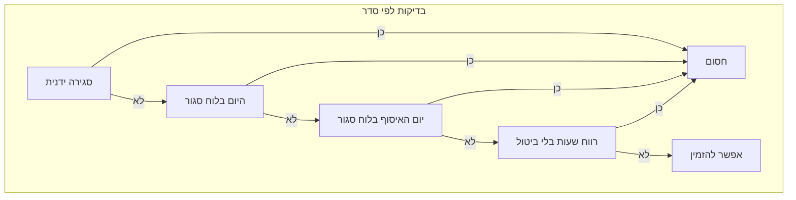

# איך השעות עובדות באפליקציה (בגובה העיניים)

## איפה בכלל נקבע «היום»?

המערכת לא מסתמכת על שעון המחשב של הלקוח כדי להחליט מה ה«יום». היא מחשבת תמיד לפי **שעון ירושלים**. זה הבסיס לכל מה שיבוא אחר כך.

---

## מה קודם חוסם הזמנה — לפי סדר

אם אחד מהדברים הבאים קורה, **לא מקבלים הזמנה** (באתר ובשרת — אותה לוגיקה):

1. **סגירה ידנית מהמנהל** — מתג «סגור הזמנות עכשיו» או דומה. זה מנצח על הכל.
2. **היום הקלנדרי סגור בלוח** — למשל חג מסומן, או שבת/ראשון בלי פתיחה מיוחדת.
3. **היום שאליו מיועדת ההזמנה (יום האיסוף שבחרתם במערכת) סגור בלוח** — גם אם היום בלוח «פתוח», אי אפשר להזמין לאותו יום איסוף.
4. **«רווח» בין שעות** — פרק זמן שבו לפי ההגדרות פשוט לא מקבלים הזמנות (לא סגירת עסק בלוח, אלא חוק פנימי של חלון הזמנות). אפשר **לאפשר בכל זאת** דרך הגדרה שמבטלת את החסימה ברווח הזה.

רק אם כל אלה לא חוסמים — ההזמנה מותרת.




---

## לאיזה **יום** בכלל מזמינים עכשיו?

**«לאיזה יום האיסוף המערכת סופרת את ההזמנה כרגע»** — זה קובע איזה **תפריט יומי** נטען, איזה **מלאי** רלוונטי, ומה ייכתב כ**תאריך** על ההזמנה. העגלה נשמרת לפי אותו יום.

איך זה נקבע? לפי **שעון ירושלים**, **השעות בהגדרות**, ו־**מתי כל שעה נמדדת** (יום לפני האיסוף או באותו יום איסוף). לפעמים זה **היום**, לפעמים **מחר** — למשל אחרי סגירת ההזמנות ליום הנוכחי אבל כבר בתוך חלון ההזמנות ליום המחרת.

---

## מה זה «השעה נספרת אתמול או היום»

לכל אחת משלוש ההגדרות (פתיחת הזמנות, אישור ידני, סגירת הזמנות) בוחרים:

- **ביום שלפני יום האיסוף** — למשל פתיחה ב־14:30 ביום הקלנדרי שלפני יום האיסוף.
- **באותו יום כמו האיסוף** — למשל סגירה ב־11:00 **בבוקר של יום האיסוף** (דוגמה מנומרת לימי חול בברירת הזרע בפרויקט).

**דוגמה לברירת הזרע בקוד (ימי חול / שישי)** — רק למסמך ראשוני בדמו; בפרודקשן הכל לפי מה ששמור במסך ההגדרות:


|              | ימי חול          | שישי            |
| ------------ | ---------------- | --------------- |
| פתיחת הזמנות | יום לפני, 14:30  | יום לפני, 14:30 |
| אישור ידני   | באותו יום, 10:00 | יום לפני, 21:00 |
| סגירת הזמנות | באותו יום, 11:00 | יום לפני, 22:00 |


כשפתיחה היא «יום לפני» וסגירה «באותו יום», נוצר **חלון רציף** לכל יום איסוף: מהשעה ביום שלפני עד שעת הסגירה ביום האיסוף. אחרי סגירת אותו יום בלוח, אם כבר נפתח חלון ההזמנות ליום הבא (למשל מאתמול ב־14:30), המערכת יכולה לעבור להזמנות **למחר** בלי להיתקע ברווח שעות בטעות.

במסך המנהל, לוח השעות מציג כל סף תחת **היום בלוח שבו הוא נמדד** (אתמול / היום / מחר).

---

## עריכה וביטול הזמנה באתר (לקוח)

**כל עוד ההזמנה עדיין לא נכנסה לשלב «אישור ידני» לפי הלוח** — הלקוח יכול לערוך או לבטל דרך עמוד ההזמנה (ובשרת יש אותה בדיקה).

**מרגע שעברה סף האישור הידני** (בשעה וביום הקלנדרי שבהם הוא נמדד לפי ההגדרות) — **לא** ניתן יותר לערוך או לבטל מהאתר; ההמשך הוא אצל המטבחה/המנהל.

במילים פשוטות: **עד השעה של האישור הידני (לא כולל הרגע שבו הוא מתחיל)** — כן; **משעת האישור הידני ואילך** — לא.

---

## זרע (דמו) מול הגדרות אמיתיות

- **בזמן ריצה** האפליקציה משתמשת ב־**הגדרות שנשמרו** (למשל ממסך ההגדרות / Firestore). כל מה ששיניתם במסך — זה מה שקובע.
- **קובץ הזרע** בפרויקט קובע רק **ברירת מחדל למסמך ראשון** כשמזריעים DB חדש או דמו — כדי שלא יהיו מספרים ישנים שלא תואמים את המסך.

---

## מה שונה כשההגדרות לא «חלון רציף»?

אם השילוב של «מתי נספרת כל שעה» אחר, יכול להיווצר **רווח** — פרק בלי הזמנות בין פתיחה לסגירה (לפעמים נקרא «רווח צהריים»). אפשר לאפשר הזמנות גם שם עם מתג ייעודי בהגדרות.

---

## איפה זה משתקף

- **לקוח:** תפריט, עגלה, «ההזמנות סגורות», עריכה/ביטול עד סף האישור הידני.
- **מנהל — תפריט יומי:** טאב היום/מחר לפי מה שהלקוחות מזמינים, התראות רווח שעות.
- **מנהל — לוח שעות בכרטיס:** תצוגה לפי יום מדידה.
- **תשלום / טקסטים:** לפי תאריך איסוף וחלון הזמנות.

---

## בדיקות ידניות מומלצות (מקרי קצה)

1. שעות שונות ביום (לפני/אחרי פתיחה, אחרי סגירה, בלילה) — שהתפריט וההזמנה מתארים את אותו יום איסוף כמצופה.
2. הסרת סגירת יום בלוח אחרי שעה — שההזמנות לא נשארות חסומות בטעות.
3. היום סגור, מחר פתוח — הזמנה למחר כשהשעות מאפשרות.
4. מחר סגור בלוח — אין תפריט/הזמנה למחר.
5. שישי לעומת חול — התנהגות נפרדת.
6. ניסיון לעקוף את האתר — השרת חוסם כשהלוגיקה אוסרת.

---

## בדיקות אוטומטיות

בפרויקט יש בדיקות (Vitest) שמכסות חלק גדול מלוגיקת השעות, החסימות, ותצוגת לוח השעות במנהל. להריץ מהשורש של הפרויקט:

```bash
npm test
```

---

## סיכום

השעות קובעות **לאיזה יום מזמינים**, **מתי נחסם קבלת הזמנות**, **מתי הזמנה עוברת לאישור ידני**, **מתי הלקוח יכול עדיין לערוך או לבטל**, ו**איך נראה לוח השעות במנהל**. כל שעה «שייכת» ליום קלנדרי מסוים לפי מה שבחרתם בהגדרות — וזה מה שהמערכת מיישמת בלקוח ובשרת.