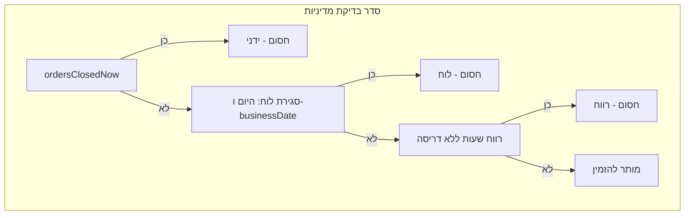

# מטריצת מצבים מלאה + לוח שעות לפי scopes + בדיקות

## הקשר למה שכבר קיים

- **מדיניות אחת (לקוח + שרת)** — כבר מיושמת: `[lib/customer-ordering-policy.ts](lib/customer-ordering-policy.ts)`, חסימה ב־`PLACE_ORDER` ב־`[lib/firebase/write-remote.ts](lib/firebase/write-remote.ts)`, דריסת רווח `[acceptOrdersDuringScheduleGap](lib/types.ts)`.
- **מה עדיין לא תואם את הכוונה שלך:** `[DayOrderHoursCallout](components/admin/day-menu-editor.tsx)` מציג תמיד תחת «- היום -» את שלושת השדות `orderOpenTime`, `manualApprovalFrom`, `closeOrdersAt` מתוך `schToday`, **בלי** להתחשב ב־`OrderTimeFieldScope` (`eveBefore` | `sameDay`) מ־`[effectiveOrderTimeScopesForCalendarIso](lib/business-schedule.ts)`. לכן «פתיחה» שנמדדת **ביום שלפני** יום האיסוף מופיעה ויזואלית תחת «היום» — זה בדיוק הפער שתיארת.

---

## חלק א — מטריצת מצבים (מושגית, מלאה)

המערכת משלבת כמה **ממדים בלתי תלויים**; התוצאה היא צירוף שלהם.

### ממדים

| ממד                             | ערכים אופייניים                                                                              | הערה                                                |
| ------------------------------- | -------------------------------------------------------------------------------------------- | --------------------------------------------------- |
| A — סגירה ידנית                 | `ordersClosedNow` on/off                                                                     | דורס זמנית את חלון ההזמנות                          |
| B — לוח (יום איסוף / היום בלוח) | פתוח / סגור לפי `closedDayIsoList` + סופ״ש                                                   | נבדק גם `calendarToday` וגם `businessDate` במדיניות |
| C — רווח שעות                   | `isInMiddayOrderGap` + אופציונלי `acceptOrdersDuringScheduleGap`                             | «סגור להזמנות» בלי סגירת עסק בלוח                   |
| D — תאריך עסקי                  | `businessDate` מ־`[resolveOrderingMenuDate](lib/business-schedule.ts)`                       | לאיזה יום נספרת ההזמנה                              |
| E — אישור ידני (בתוך חלון)      | `orderRequiresManualApproval`                                                                | עמודה `pendingApproval` מול `work`                  |
| F — scopes לכל סף               | לכל אחד מ־`orderOpenTime` / `manualApprovalFrom` / `closeOrdersAt`: `eveBefore` או `sameDay` | קובע **באיזה יום קלנדרי** נמדדת השעה                |

### מטריצת תוצאה ללקוח (פישוט — «מה קורה»)

לא ניתן לטבלה אחת בלי עשרות שורות; המבנה המומלץ:

**טבלת תרחישי ליבה** (למילוי במסמך / בבדיקות):

| תרחיש                   | ordersClosedNow | לוח היום | לוח businessDate | רווח שעות   | צפי: הזמנה?       | סיבת חסימה אם לא |
| ----------------------- | --------------- | -------- | ---------------- | ----------- | ----------------- | ---------------- |
| רגיל פתוח               | false           | פתוח     | פתוח             | לא          | כן                | —                |
| סגור ידנית              | true            | *        | *                | *           | לא                | manual           |
| חג היום                 | false           | סגור     | *                | *           | לא                | calendar         |
| יום איסוף סגור          | false           | פתוח     | סגור             | לא          | לא                | calendar         |
| אחרי סגירה / לפני פתיחה | false           | פתוח     | פתוח             | כן          | לא (אלא אם דריסה) | scheduleGap      |
| דריסה ברווח             | false           | פתוח     | פתוח             | כן + accept | כן                | —                |

מטריצה **מלאה** לפי שעה דורשת להוסיף עמודת **שעה מדומה** (Jerusalem) ואת ענף `resolveOrderingMenuDate` — זה ייכנס לבדיקות בקוד (ראו חלק ג).

---

## חלק ב — לוח שעות במנהל: התנהגות רצויה

**עקרון:** כל סף (פתיחה / אישור ידני / סגירה) מוצג תחת **כותרת היום הקלנדרי שבו השעה נמדדת**, לפי ה־scope של **אותו שדה** ביחס ל־**יום האיסוף** שהשורה מתארת.

- ליום איסוף `P` ושדה עם scope `**sameDay`** → השעה מוצגת תחת בלוק עם תאריך `**P`**.
- ליום איסוף `P` ושדה עם scope `**eveBefore**` → השעה מוצגת תחת בלוק עם תאריך `**P - 1 יום**` (בממשק: תאריך עברי + אופציונלי תווית «יום לפני האיסוף» לשורות שמקושרות ל־`P`).

**מיפוי לשני בלוקי היום/מחר הקיימים:**

- עבור **יום האיסוף = `calendarToday`**: ספים ב־`eveBefore` נופלים ל־**עמודה של אתמול** (`addCalendarDaysIso(calendarToday, -1)`); ספים ב־`sameDay` נשארים תחת **היום**.
- עבור **יום האיסוף = `tomorrowIso`**: ספים ב־`eveBefore` נופלים ל־**היום** (כי «יום לפני מחר» = היום); ספים ב־`sameDay` תחת **מחר**.

אם ליום קלנדרי מסוים **אין אף שורה** (אחרי הפיצול) — לא מציגים כותרת ריקה ליום הזה (או משאירים רק כותרות עם תוכן — להחליט במימוש מינימלי: להסתיר סקציות ריקות).

**קבצים עיקריים:** `[components/admin/day-menu-editor.tsx](components/admin/day-menu-editor.tsx)` (פונקציה `DayOrderHoursCallout`), שימוש ב־`[activeScheduleForCalendarIso](lib/business-schedule.ts)` + `[effectiveOrderTimeScopesForCalendarIso](lib/business-schedule.ts)` לכל יום איסוף (היום / מחר בלוח).

**שימו לב:** אותה **מדיניות חישוב** כבר קיימת בלוגיקה; כאן רק **תצוגה** מתייחסת ל־scopes — בלי לשנות `resolveOrderingMenuDate` אלא אם יתגלה אי־התאמה.

---

## חלק ג — מטריצת בדיקות (Vitest) — העדיפות שביקשת

**מצב נוכחי:** `[lib/customer-ordering-policy.test.ts](lib/customer-ordering-policy.test.ts)` + `[lib/business-schedule.resolve-ordering.test.ts](lib/business-schedule.resolve-ordering.test.ts)` — כיסוי מינימלי.

**להרחיב:**

1. **קבועי זמן** — פונקציית עזר בבדיקות שמחזירה `Date` לפי תאריך+שעה בירושלים (למשל ISO עם offset `+03:00`) כדי למנוע רגרסיות של TZ.
2. `**resolveOrderingMenuDate`** — טבלאות מבחנים לפי שלושת הענפים בפונקציה (שורות 447–486 ב־`[business-schedule.ts](lib/business-schedule.ts)`):
  - `eveBefore` + `sameDay` לסגירה (ברירת חול)
  - ענף `closeOrdersAt === "sameDay"` בלבד
  - ענף ברירת `lateStr` / מחר סגור בלוח
3. `**isInMiddayOrderGap`** — לפחות מקרה אחד לכל אחד משני המבנים בפונקציה (שורות 332–356 ו־344–355) — חלון רציף מול «רווח צהריים».
4. `**customerOrdersBlockedByPolicy**` — כבר יש בסיס; להוסיף צירופים: לוח סגור רק על `businessDate`, רק על היום, ושניהם פתוחים עם רווח.
5. (אופציונלי) `**orderRequiresManualApproval**` — נקודת זמן אחת לפני/אחרי סף לפי scope.

**ארגון קוד:** קובץ אחד `lib/business-schedule.matrix.test.ts` (או פיצול לפי נושא) עם `describe` לפי פונקציה ו־`it.each` לטבלאות.

---

## חלק ד — תשובה ל«לא עשית את זה?»

- **מדיניות אחת + שרת** — **כן**, זה בוצע קודם.
- **לוח שעות לפי «יום לפני» בממשק** — **לא**; זה מה שמתוכנן בחלק ב.
- **מטריצת בדיקות מלאה** — **חלקית** (קיימות בדיקות בסיסיות); ההרחבה בחלק ג.

---

## סיכום משימות מימוש (אחרי אישור)

1. ליישם פיצול תצוגה ב־`DayOrderHoursCallout` לפי scope לכל שדה ויום איסוף (עמודות/סקציות לפי תאריך מדידה).
2. להרחיב את מערך בדיקות ה־Vitest למטריצת מצבים של השעות והמדיניות כמתואר בחלק ג.

